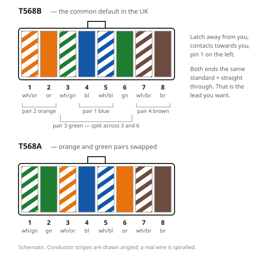

# Cat5 and Cat5e: the RJ45 pin order

Both standards use the same four twisted pairs — blue, orange, green, brown —
and differ only in **which pins the orange and green pairs land on**. Pick one
and use it at both ends.

## Pin order

| Pin | T568B | T568A |
| --- | --- | --- |
| 1 | white/orange | white/green |
| 2 | orange | green |
| 3 | white/green | white/orange |
| 4 | blue | blue |
| 5 | white/blue | white/blue |
| 6 | green | orange |
| 7 | white/brown | white/brown |
| 8 | brown | brown |

Pins 4, 5, 7 and 8 are identical in both. Only 1, 2, 3 and 6 move.

## Which one

**T568B** is the usual default in UK domestic and commercial installs, and is
what most patch leads and pre-punched modules are printed for. T568A is the US
residential standard and is what you will meet on some imported hardware.

Neither is electrically better. The only rule that matters: **both ends of a
lead must use the same standard.** A lead with B at one end and A at the other
is a crossover — pins 1/2 and 3/6 swapped — and modern gear auto-senses that
anyway, which makes an accidental one a fault you will not notice until you
meet kit that does not.

## The blue pair is the odd one out

Pair 1, blue, sits on pins 4 and 5 in the **middle**, and pair 3, green, is
split around it onto pins 3 and 6. That split is deliberate: it keeps pins 4/5
free as a single pair for the telephone wiring the layout had to coexist with.
It is also why you cannot lay the four pairs out left to right in colour order
and expect the lead to work.

## Which pairs actually carry traffic

10BASE-T and 100BASE-TX use **two pairs only** — pins 1, 2, 3 and 6, the orange
and green pairs. 1000BASE-T (gigabit) uses **all four**. A lead with a broken
brown or blue pair will therefore test fine at 100 Mbit and fail at gigabit,
which is the single most common "it worked yesterday" cable fault.

## Orientation

Hold the plug with the **latch facing away from you and the gold contacts
towards you**. Pin 1 is then on the left. Get this backwards and you will punch
a perfect mirror image of the correct lead.
