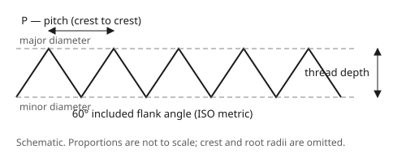

# Thread pitch and tap drills

Pitch is measured **crest to crest**, along the axis. A thread gauge reads it
directly; a rule across ten crests divided by ten is close enough to pick the
right row below.

## ISO metric

Coarse is the default: if a bolt is metric and nobody said otherwise, it is
coarse. The fine column lists the pitches the standard also admits at that
diameter — **measure, never assume**, because a fine thread in a coarse hole
strips both.

| Size | Coarse pitch (mm) | Tap drill (mm) | Fine pitches (mm) |
| --- | --- | --- | --- |
| M1.6 | 0.35 | 1.25 | |
| M2 | 0.4 | 1.60 | |
| M2.5 | 0.45 | 2.05 | |
| M3 | 0.5 | 2.50 | |
| M3.5 | 0.6 | 2.90 | |
| M4 | 0.7 | 3.30 | |
| M5 | 0.8 | 4.20 | |
| M6 | 1 | 5.00 | |
| M8 | 1.25 | 6.80 | 1 |
| M10 | 1.5 | 8.50 | 1.25 · 1 |
| M12 | 1.75 | 10.20 | 1.5 · 1.25 |
| M14 | 2 | 12.00 | 1.5 |
| M16 | 2 | 14.00 | 1.5 |
| M18 | 2.5 | 15.50 | 2 · 1.5 |
| M20 | 2.5 | 17.50 | 2 · 1.5 |
| M22 | 2.5 | 19.50 | 2 · 1.5 |
| M24 | 3 | 21.00 | 2 |

**The tap drill column is the standard's stocked drill, not `major − pitch`.**
The two agree on most rows and disagree on four in this range — M4.5, M8, M9 and
M12 — so the arithmetic shortcut is close but not the published figure. Use the
column.

## Whitworth: BSW and BSF

Imperial legacy sizes, quoted by **threads per inch** rather than pitch. Both
share the 55° Whitworth form, so a BSW tap will not run down a BSF hole.

| Size | tpi (BSW) | Pitch (mm) | tpi (BSF) | Pitch (mm) |
| --- | --- | --- | --- | --- |
| 1/8" | 40 | 0.635 | | |
| 3/16" | 24 | 1.058 | 32 | 0.794 |
| 1/4" | 20 | 1.270 | 26 | 0.977 |
| 5/16" | 18 | 1.411 | 22 | 1.156 |
| 3/8" | 16 | 1.588 | 20 | 1.270 |
| 7/16" | 14 | 1.814 | 18 | 1.411 |
| 1/2" | 12 | 2.117 | 16 | 1.588 |
| 5/8" | 11 | 2.309 | 14 | 1.814 |
| 3/4" | 10 | 2.540 | | |

## BSP is a pipe designation, not a size

**G ½" measures 20.955 mm across the major diameter**, at 1.814 mm pitch. The
"½" names the nominal *bore* of the pipe the fitting suits — it is a name, not a
measurement, and there is nothing to convert. Measure a fitting thread and you
will land between M20 and M22 with no metric or Whitworth row that fits; that is
the signal you are holding a pipe thread.

BSPP (the parallel G series) is what a tap and die set will cut. BSPT (the
tapered R series) is not interchangeable with it, and its "diameter" depends on
where along the thread you measured.

## Where these figures come from

| Data | Source | Standing |
| --- | --- | --- |
| Metric pitches | ISO 262:1998 Table 1 | Primary standard |
| Metric tap drills | ISO 2306:1972 Table 1 | Primary standard |
| BSW / BSF | Manufacturer charts citing BS 84 | Secondary |
| BSPP major diameter and pitch | ISO 228-1:2000 Table 1 | Primary standard |

Full sourcing, including what was *not* retrieved, is in the project's thread
series research note. The BSW/BSF rows are secondary data: BS 84 itself was
never opened, so treat a disagreement with a printed chart as the chart's win.
